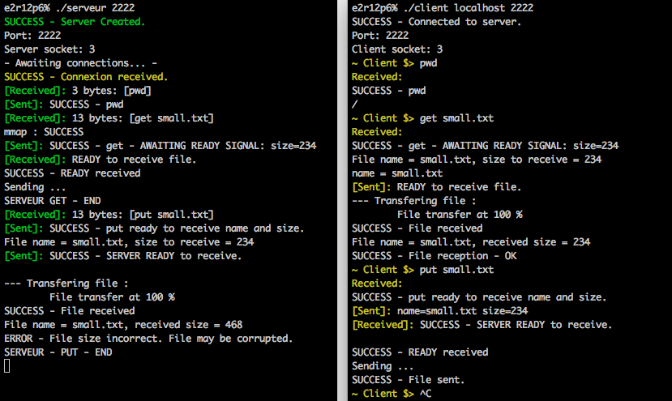

# File_Transfer_Protocol
An implementation of a FTP server and client in C.

This project is a simple implementation of a file transfer protocol server in C.
By using commands such as bind(), connect(), or listen(), the objective was to create a server and a client that can communicate to each other at distance, by specifying a port for the server, and an address and a port for the client.
This implementation allows the client to use simple unix commands: ls, pwd, and cd. It also allows the transfer of files with put and get commands.

The point of the project was to understand the concept of server/client communication. In this idea, the server does not follow the RFC norm.

